# YourChore

A family chore and reward system where children complete chores, earn stars, and redeem rewards. Built with fun, kid-friendly animations and a powerful parent admin console.

## Features

### For Kids (ages 4-12)
- See today's chores as big, colourful cards
- Tap "Done!" to complete chores and earn stars
- Watch your **Star Jar** fill up with golden stars
- Claim rewards when you have enough stars
- Fun celebrations with confetti and animations

### For Parents
- Create and manage chores with recurring schedules
- Set up rewards with star costs
- Add children with avatars and optional PIN login
- View weekly completion stats and activity history
- Adjust star balances manually
- Optional chore approval mode

### Technical
- Progressive Web App (installable on phones/tablets)
- Offline support for basic viewing
- Self-hostable with Docker
- SQLite database (zero config)
- JWT authentication with parent/child roles

## Quick Start

### Local Development

```bash
# Install dependencies
npm install

# Set up environment
cp .env.example .env
# Edit .env and set a strong JWT_SECRET

# Initialize database and start dev server
npx prisma generate
npx prisma db push
npm run dev

# (Optional) Seed with demo data
npm run seed
```

Visit `http://localhost:3000`

### Demo Credentials (after seeding)

| Account | Email / PIN | Password |
|---------|-------------|----------|
| Parent | parent@demo.com | demo1234 |
| Emma (child) | PIN: 1234 | - |
| Jack (child) | No PIN | - |

## Screenshots

### Landing & Account Setup
<p align="center">
  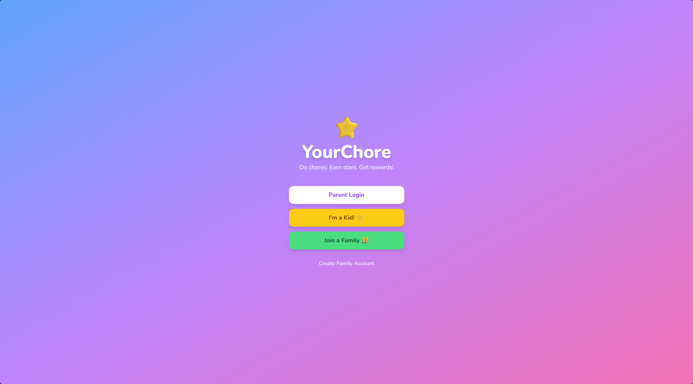
  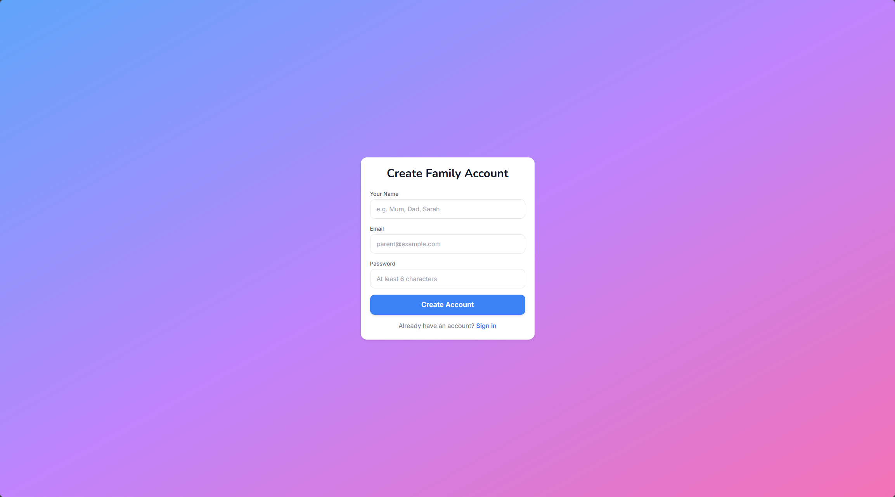
  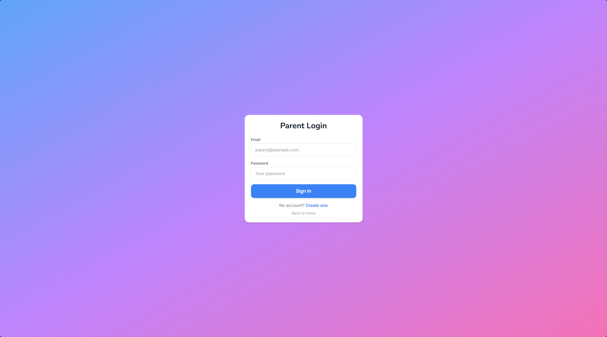
  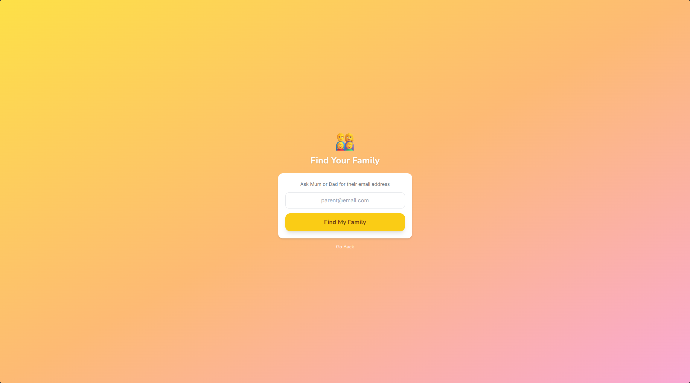
  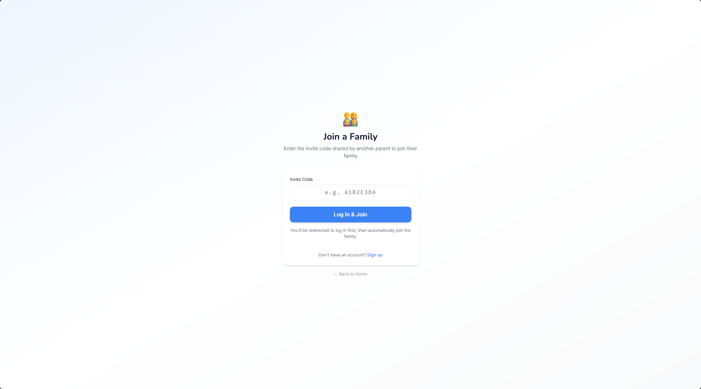
</p>

### Parent Dashboard
<p align="center">
  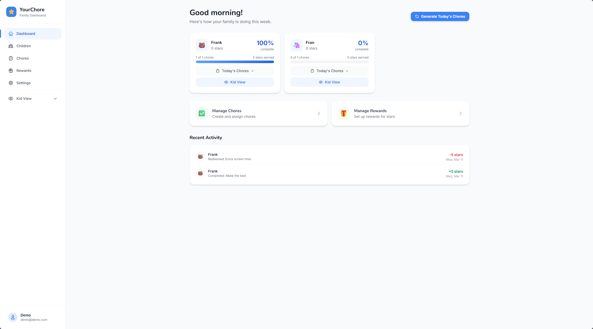
</p>

<p align="center">
  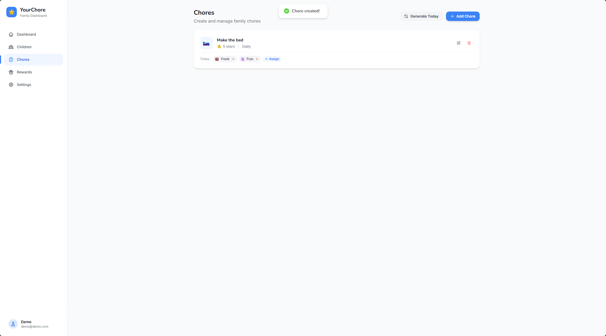
</p>

### Managing Chores & Rewards
<p align="center">
  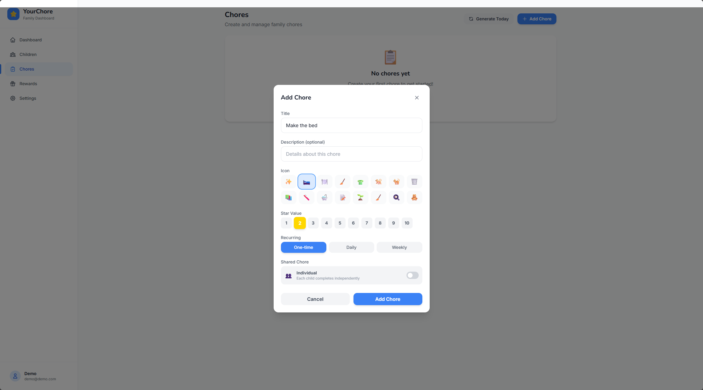
  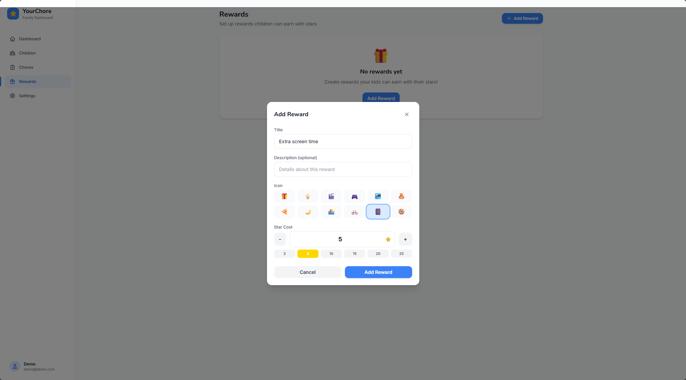
  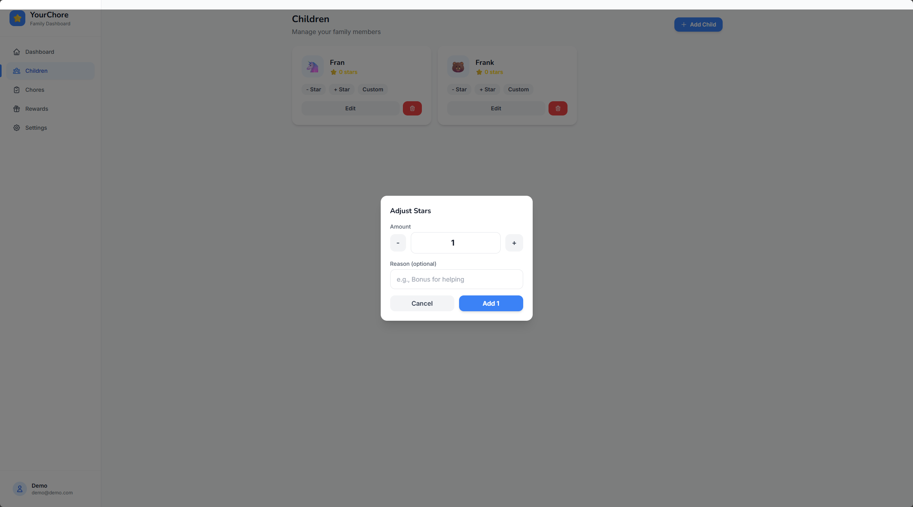
</p>

### Kid Experience
<p align="center">
  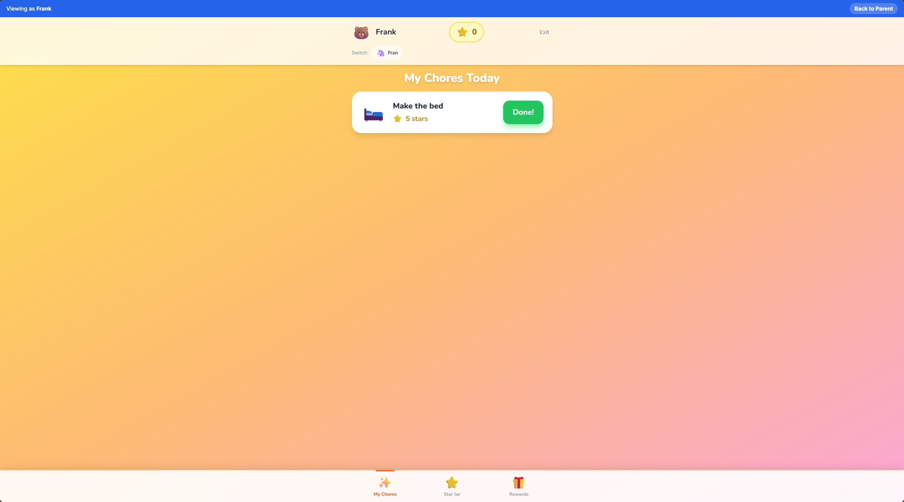
  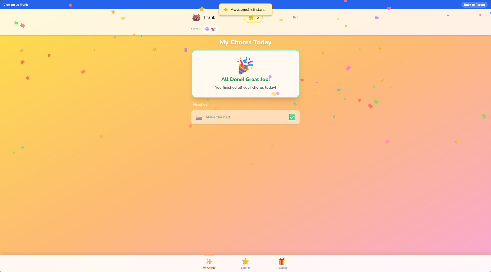
  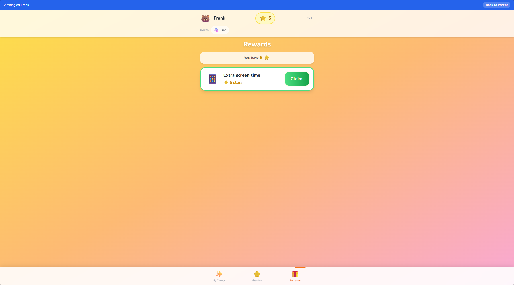
  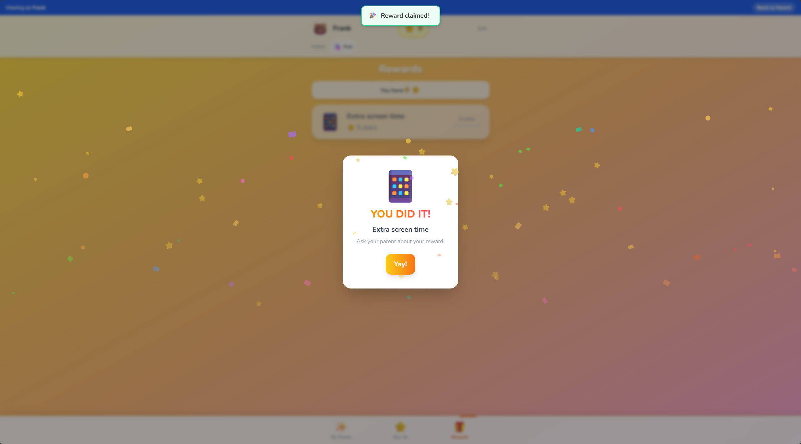
  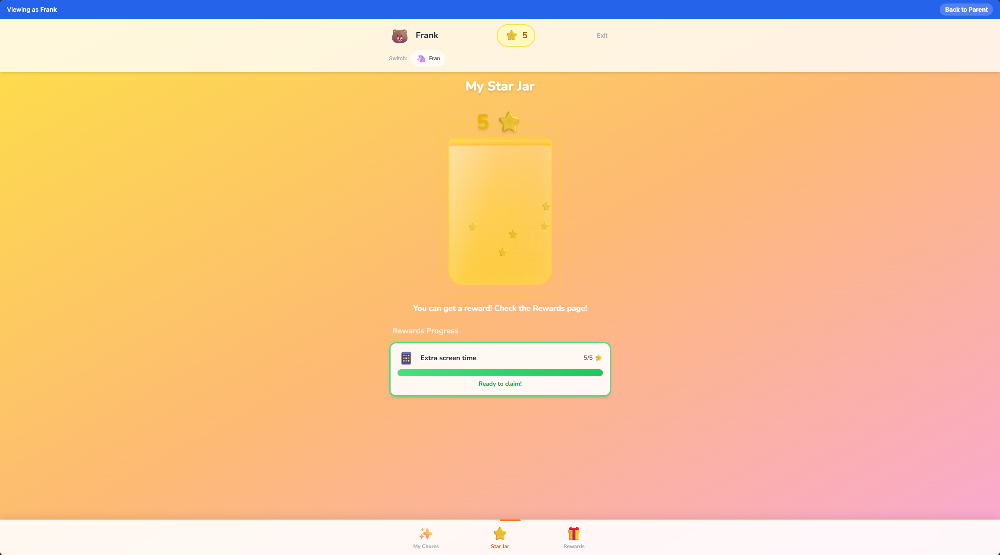
</p>

---

### Docker Compose

```bash
# Clone the repository
git clone <repo-url> yourchore
cd yourchore

# Set your JWT secret
export JWT_SECRET=$(openssl rand -hex 32)

# Build and run
docker compose up -d
```

### Portainer Stack

Copy the contents of `docker-compose.yml` into a new Portainer stack. Set these environment variables:

| Variable | Required | Default | Description |
|----------|----------|---------|-------------|
| `JWT_SECRET` | Yes | - | Secret key for JWT tokens (min 32 chars) |
| `PORT` | No | 3000 | Port to expose the app on |
| `REQUIRE_APPROVAL` | No | false | Require parent approval for completed chores |
| `NEXT_PUBLIC_APP_NAME` | No | YourChore | App display name |
| `NEXT_PUBLIC_APP_URL` | No | http://localhost:3000 | Public URL of the app |

Data is persisted in the `yourchore_data` Docker volume.

## Architecture

```
YourChore (Next.js 15 Full-Stack)
├── Frontend (React 19 + TailwindCSS + Framer Motion)
│   ├── Child Interface (/, /child/*)
│   │   ├── Chore cards with completion animations
│   │   ├── Star Jar with fill animations
│   │   └── Reward redemption with celebrations
│   └── Parent Admin (/parent/*)
│       ├── Dashboard with weekly stats
│       ├── Children management
│       ├── Chore management with recurring schedules
│       └── Reward management
├── API (Next.js Route Handlers)
│   ├── /api/auth/* (JWT auth for parents + PIN auth for children)
│   ├── /api/children/* (CRUD + star adjustments)
│   ├── /api/chores/* (CRUD)
│   ├── /api/assignments/* (assign, complete, approve)
│   ├── /api/rewards/* (CRUD + redemption)
│   └── /api/stats (weekly analytics)
└── Database (SQLite via Prisma)
    ├── Users (parents)
    ├── Children
    ├── Chores
    ├── ChoreAssignments
    ├── StarTransactions
    ├── Rewards
    └── RewardRedemptions
```

## Technology Stack

| Layer | Technology |
|-------|-----------|
| Framework | Next.js 15 (App Router) |
| UI | React 19, TailwindCSS, Framer Motion |
| Database | SQLite (via Prisma ORM) |
| Auth | JWT (jose), bcryptjs |
| State | React hooks, Zustand |
| Notifications | react-hot-toast |
| Icons | Emoji-based (zero dependencies) |
| PWA | Custom service worker |
| Deployment | Docker, docker-compose |

## Project Structure

```
yourchore/
├── prisma/
│   ├── schema.prisma      # Database schema
│   └── seed.ts             # Demo data seeder
├── public/
│   ├── manifest.json       # PWA manifest
│   ├── sw.js               # Service worker
│   └── icons/              # PWA icons
├── src/
│   ├── app/
│   │   ├── api/            # API route handlers
│   │   ├── child/          # Child interface pages
│   │   ├── parent/         # Parent admin pages
│   │   ├── login/          # Auth pages
│   │   ├── register/
│   │   ├── child-select/   # Child login flow
│   │   ├── layout.tsx      # Root layout
│   │   └── page.tsx        # Landing page
│   ├── components/         # Shared components
│   ├── hooks/              # Custom React hooks
│   └── lib/                # Utilities (auth, db, icons, dates)
├── docker-compose.yml      # Portainer-ready deployment
├── Dockerfile              # Multi-stage production build
└── package.json
```

## PWA Installation

YourChore can be installed as a Progressive Web App:

1. Open the app in Chrome/Safari
2. Look for "Add to Home Screen" or "Install" prompt
3. The app icon will appear on your device's home screen
4. Works offline for viewing cached chores

## Configuration

### Approval Mode

Set `REQUIRE_APPROVAL=true` to require parents to approve completed chores before stars are awarded. When disabled (default), stars are awarded immediately when children mark chores as done.

### Child Login

Children can log in by:
1. Entering their parent's email to find their family
2. Selecting their profile
3. Entering their PIN (if one is set)

PINs are optional 4-digit codes set by parents for each child.

## Development

```bash
# Run development server
npm run dev

# Open Prisma Studio (database GUI)
npm run db:studio

# Reset database
rm -f prisma/data/yourchore.db
npx prisma db push
npm run seed
```

## License

MIT
